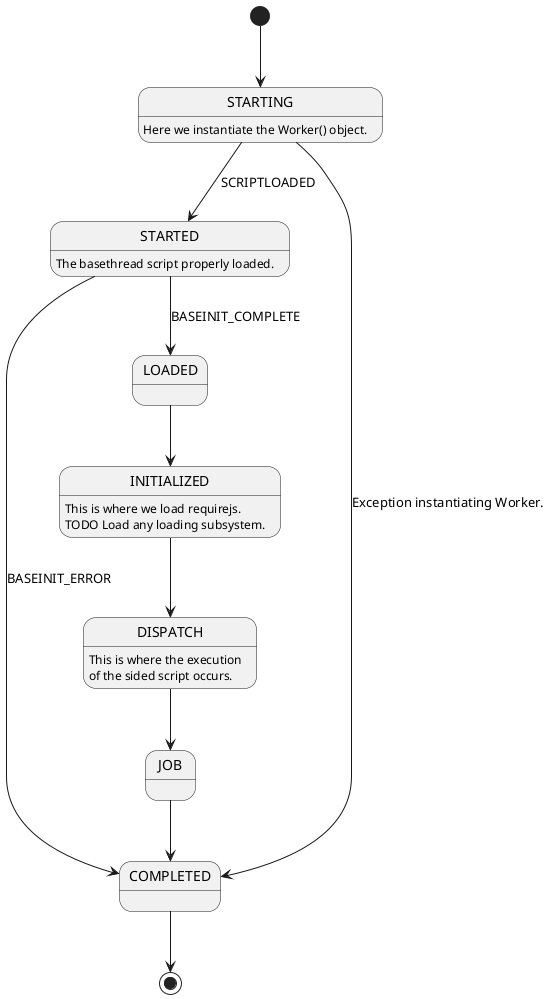

# webjobs.es6
ES6 version of webjobs concept


## Dispatching

The main key to managing a thread was devising a protocol to initialize, start, and complete work.

Each message is an int because I prefer int compares to string compares for efficiency.

```plantuml
Main->WebWorker : start
WebWorker->Main : SCRIPTLOADED
Main->WebWorker : BASEINIT
WebWorker->Main : BASEINIT_COMPLETE
WebWorker->Main : BASEINIT_ERROR
Main->WebWorker : DISPATCH
WebWorker->Main : DISPATCH_COMPLETE
WebWorker->Main : DISPATCH_ERROR
```

Some enums that matter

```plantuml
class MessagIds <<enumeration>> {
  SCRIPTLOADED: 0,
  BASEINIT: 1,
  BASEINIT_COMPLETE: 2,
  BASEINIT_ERROR: 3,
  DISPATCH: 4,
  DISPATCH_COMPLETE: 5,
  DISPATCH_ERROR: 6
}

class WorkerStates <<enumeration>> {
  STARTING: 0,
  STARTED: 1,
  LOADED: 2,
  INITIALIZED: 3,
  DISPATCH: 4,
  JOB: 5,
  COMPLETED: 6
}
```

And a state machine describing how a thread is managed.



## Concept

The idea is to make it easy to submit jobs to a managed threadpool.
Both client and thread base structureshave to exist.

But the end result would be queueing work and using a [Promise](https://developer.mozilla.org/en-US/docs/Web/JavaScript/Reference/Global_Objects/Promise) to then or catch the result.

```javascript
  function exec() {
    var that = this;
    job = TroubleMaker.start({
      jobpath: 'src/ParsingJob.js'
    });
    job.then(function(result) {
      tht._updateResult(result.toString());
    }).catch(function(e) {
      console.error(e);
      that.dispatchEvent('JobFailed');
    });
  }
```
## Drives

Although threads are a new are for browsers.
it is noted there is a sharp spin up times for these threads.

Only a messaging/event system works between Main and the threads...so it will be the goal to manage and recycle them reinitializing them.
