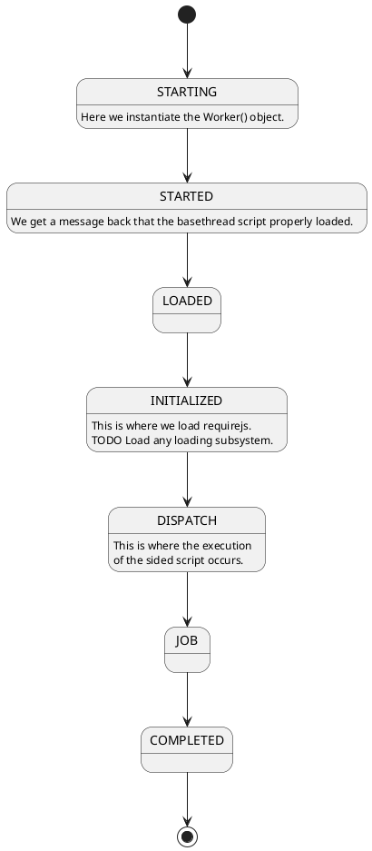

# webjobs.es6
ES6 version of webjobs concept


## Dispatching

The main key to managing a thread was devising a protocol to initialize, start, and complete work.

Each message is an int because I prefer int compares to string compares for efficiency.

```plantuml
Main->WebWorker : start
WebWorker->Main : SCRIPTLOADED
Main->WebWorker : BASEINIT
WebWorker->Main : BASEINIT_COMPLETE
WebWorker->Main : BASEINIT_ERROR
Main->WebWorker : DISPATCH
WebWorker->Main : DISPATCH_COMPLETE
WebWorker->Main : DISPATCH_ERROR
```

Some enums that matter

```plantuml
class MessagIds <<enumeration>> {
  SCRIPTLOADED: 0,
  BASEINIT: 1,
  BASEINIT_COMPLETE: 2,
  BASEINIT_ERROR: 3,
  DISPATCH: 4,
  DISPATCH_COMPLETE: 5,
  DISPATCH_ERROR: 6
}

class WorkerStates <<enumeration>> {
  STARTING: 0,
  STARTED: 1,
  LOADED: 2,
  INITIALIZED: 3,
  DISPATCH: 4,
  JOB: 5,
  COMPLETED: 6
}
```

And a state machine describing how a thread is managed.


